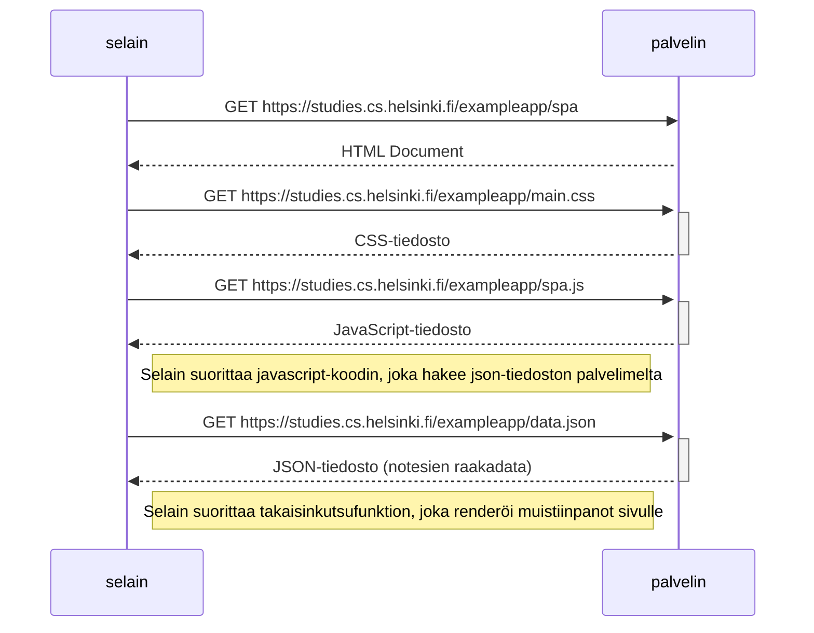

```mermaid
sequenceDiagram
    participant selain
    participant palvelin
    
    selain->>palvelin: GET https://studies.cs.helsinki.fi/exampleapp/spa
    activate palvelin
    palvelin-->>selain: HTML Document
    
    selain->>palvelin: GET https://studies.cs.helsinki.fi/exampleapp/main.css
    activate palvelin
    palvelin-->>selain: CSS-tiedosto
    deactivate palvelin
	
    selain->>palvelin: GET https://studies.cs.helsinki.fi/exampleapp/spa.js
    activate palvelin
    palvelin-->>selain: JavaScript-tiedosto
    deactivate palvelin
	
    Note right of selain: Selain suorittaa javascript-koodin, joka hakee json-tiedoston palvelimelta
	
    selain->>palvelin: GET https://studies.cs.helsinki.fi/exampleapp/data.json
    activate palvelin
    palvelin-->>selain: JSON-tiedosto (notesien raakadata)
    deactivate palvelin
	
    Note right of selain: Selain suorittaa takaisinkutsufunktion, joka renderöi muistiinpanot sivulle
```
