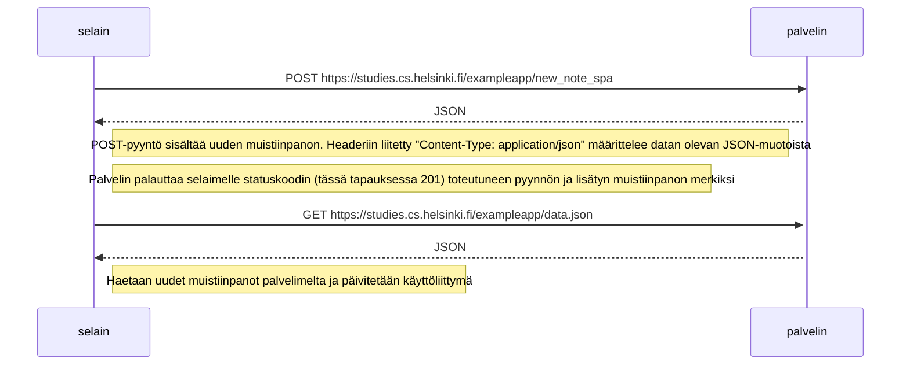

```mermaid
sequenceDiagram
    participant selain
    participant palvelin
    
    selain->>palvelin: POST https://studies.cs.helsinki.fi/exampleapp/new_note_spa
    activate palvelin
    palvelin-->>selain: JSON 

    Note right of selain: POST-pyyntö sisältää uuden muistiinpanon. Headeriin liitetty "Content-Type: application/json" määrittelee datan olevan JSON-muotoista
    Note right of selain: Palvelin palauttaa selaimelle statuskoodin (tässä tapauksessa 201) toteutuneen pyynnön ja lisätyn muistiinpanon merkiksi
    
    selain->>palvelin: GET https://studies.cs.helsinki.fi/exampleapp/data.json
    activate palvelin
    palvelin-->>selain: JSON

    Note right of selain: Haetaan uudet muistiinpanot palvelimelta ja päivitetään käyttöliittymä
	
```
